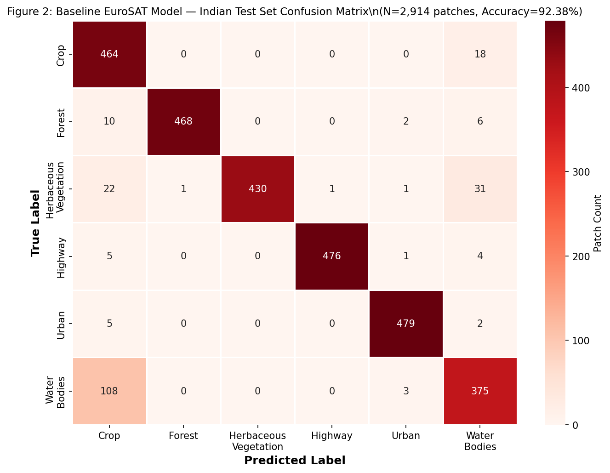
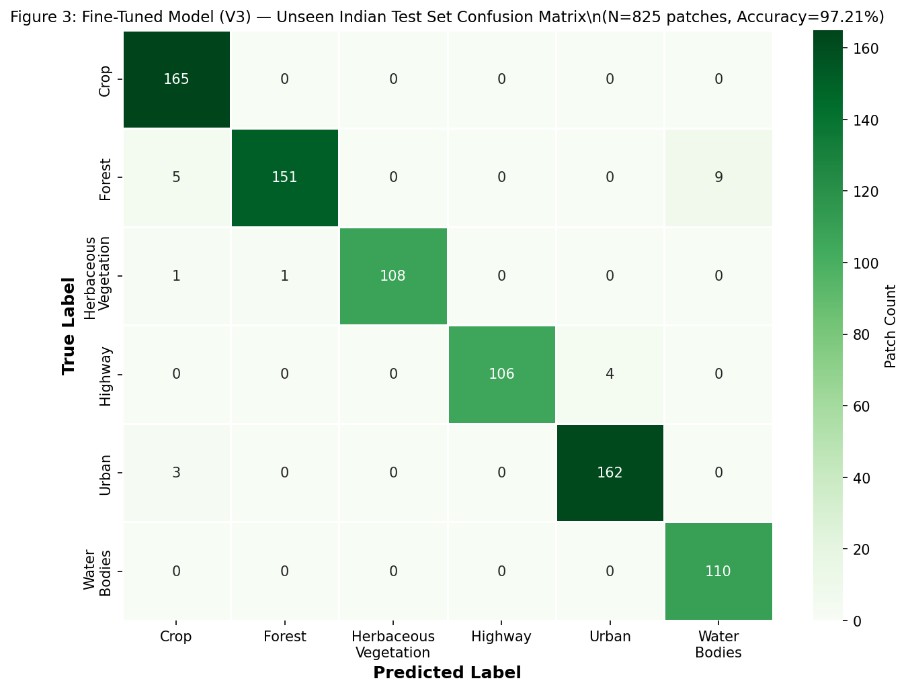
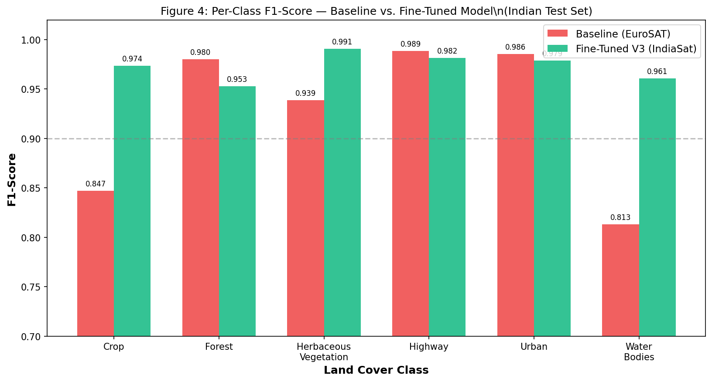
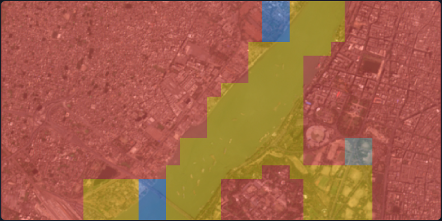
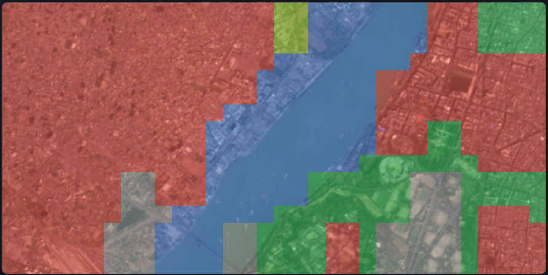
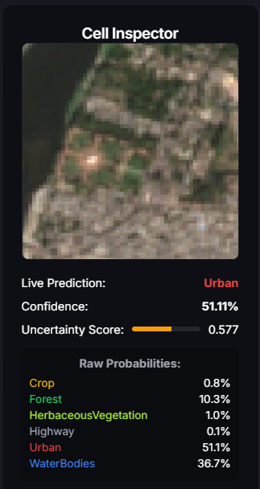
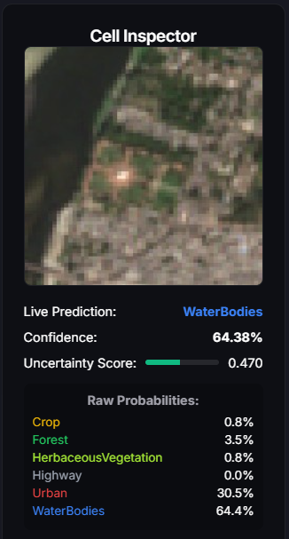

# GeoScan: A Browser-Based Active Learning System for Targeted Domain Adaptation of Satellite Land-Cover Classification to Indian Geospatial Conditions

**Authors:** [Author Name], [Institution], [Supervisor Name]
**Target Journal:** *Remote Sensing* (MDPI) — ISSN 2072-4292
**Manuscript Type:** Original Research Article

---

## Abstract

Models trained on the EuroSAT benchmark for satellite land-use and land-cover (LULC) classification achieve high overall accuracy yet harbour systematic class-specific biases when applied to Indian Sentinel-2 imagery—biases that aggregate accuracy metrics conceal. This paper presents **GeoScan**, a browser-based Human-in-the-Loop Active Learning platform that identifies, quantifies, and corrects these biases without centralised GPU infrastructure. GeoScan deploys a quantized EfficientNetV2-Small CNN via WebAssembly in the user's browser (ONNX Runtime Web), computes Shannon Entropy locally to surface high-uncertainty patches to an expert annotator, and persists corrections as a zero-image-storage coordinate dataset—*IndiaSat*—in Google Cloud Firestore.

On 53 curated Indian coordinates (2,914 inference patches), the unmodified EuroSAT baseline achieves 92.38% overall accuracy—numerically comparable to its 92.30% source-domain performance—yet the per-class analysis reveals severe spectral confusion concentrated in WaterBodies (22.8% class error rate, driven by the spectral similarity of turbid, algae-laden Indian rivers to irrigated cropland) and HerbaceousVegetation (11.5% class error rate). One cycle of entropy-guided active learning fine-tuning directly targets and resolves these confusions. On a completely separate, class-balanced final test set of 15 unseen Indian coordinates (825 patches), the fine-tuned model achieves **97.21% overall accuracy** (Macro F1 = 0.973). No WaterBodies errors were detected across the 110-patch WaterBodies test subset (95% CI upper bound on true error rate: 2.7%), compared to the baseline's 22.8% class error rate. HerbaceousVegetation class error rate fell from 11.5% to 1.8%. The platform operates at zero marginal server-side inference cost.

**Keywords:** domain adaptation; land-use classification; active learning; edge computing; WebAssembly; EfficientNetV2; Sentinel-2; India; remote sensing; class-specific bias

---

## 1. Introduction

### 1.1 The Problem: Hidden Class Bias in Cross-Regional LULC Models

The EuroSAT dataset (Helber et al., 2019) established a widely adopted benchmark for satellite land-use and land-cover (LULC) classification from Sentinel-2 imagery. A ResNet-50 fine-tuned on EuroSAT achieves 98.57% overall accuracy on the European source domain; EfficientNetV2 architectures achieve comparable performance while requiring fewer parameters (Tan & Le, 2021).

However, overall accuracy is a deceptive metric when evaluating geographic generalisation. A model that classifies five of six land-cover classes near-perfectly while catastrophically failing on the sixth can still report aggregate accuracy above 90%. This paper is concerned precisely with that failure mode, which we term *class-specific domain bias*, and which we demonstrate is the dominant failure pattern when EuroSAT-trained models encounter Indian Sentinel-2 imagery.

Consider the spectral situation for water bodies. EuroSAT's River and SeaLake classes capture European rivers and lakes: generally clear or mildly turbid water with a characteristic low-reflectance signature in Sentinel-2's B4 (red) and B3 (green) bands. Major Indian rivers—the Yamuna through Delhi, the Hooghly through Kolkata, the Godavari through Andhra Pradesh—carry substantially higher sediment loads and are subject to pervasive algal bloom contamination driven by agricultural runoff and urban effluent. The resulting spectral signature shifts toward green wavelengths, overlapping directly with the spectral range of the Crop class in Sentinel-2 RGB imagery. Our evaluation confirms this: the unmodified EuroSAT model misclassifies 108 of 111 WaterBodies errors (97.3% of water-class errors) as Crop—not as noise distributed across all classes, but as a single systematic, interpretable confusion that a conventional accuracy figure of 92.38% entirely obscures.

This kind of bias—high overall accuracy masking severe class-specific error—is particularly dangerous in operational contexts. A land-use monitoring system deployed for drought or flood response that systematically misidentifies polluted rivers as cropland produces not random noise but confidently wrong, structured outputs.

### 1.2 The Annotation Bottleneck

The direct remedy is target-domain fine-tuning: collect labelled data from the Indian geographic domain and retrain. The constraint is cost. Expert annotation of satellite imagery—requiring the ability to distinguish active fallow from scrubland, turbid river from paddy field, informal settlement from bare earth—cannot be delegated to crowdsourcing platforms without substantial quality loss. Building an Indian counterpart to EuroSAT's 27,000 patches through conventional annotation workflows would require months and considerable institutional resources.

Active Learning addresses this by directing annotation effort to precisely the patches where the current model is most uncertain—the patches at and around the decision boundaries that define the systematic bias. This is not merely a matter of annotation efficiency; in this context, it is the mechanism by which the relevant class confusions are specifically identified and corrected. Settles (2012) demonstrated annotation burden reductions of 40–60% relative to random sampling for equivalent target accuracy; Wang et al. (2017) confirmed similar results for CNN image classification.

### 1.3 The Infrastructure Constraint

A second barrier is the requirement for centralised GPU infrastructure to run inference. This is not merely a cost issue in abstracto: the communities most dependent on satellite land-use intelligence—agricultural extension services, regional urban planning bodies, disaster response agencies in mid-income countries—are precisely those with least reliable access to GPU cloud capacity. A classification system that works only when GPU instances are provisioned is a system that works only for well-resourced actors.

### 1.4 Contributions

GeoScan addresses all three problems simultaneously.

1. **Zero-cost edge inference.** A quantized EfficientNetV2-Small (INT8, 20.7 MB) runs via WebAssembly in any modern browser, eliminating server-side GPU requirements entirely. Sliding-window inference across a 1792x896 Sentinel-2 panoramic composite completes in 3–4.5 seconds on a standard laptop CPU.

2. **Browser-native uncertainty sampling.** Shannon Entropy is computed locally over each patch's 6-class softmax vector, surfacing high-uncertainty (H > 0.6) patches to the expert without any server round-trip.

3. **The Virtual Quadtree Namespace.** A purely mathematical hierarchical addressing scheme partitioning the Indian subcontinent into 67 million uniquely addressable ~640m x 640m leaf cells, requiring no server-side geographic database.

4. **IndiaSat: zero-image-storage ground truth.** Expert corrections are stored as WGS84 bounding box coordinate shards in Google Cloud Firestore. No pixel data is stored; Google Earth Engine re-renders the corresponding Sentinel-2 patch at training time on demand. Storage cost per annotation: effectively zero regardless of dataset scale.

5. **Quantified class-specific bias correction.** We demonstrate that a single active learning cycle reduces the WaterBodies class error rate from 22.8% to below the detection threshold of the 110-patch test subset (95% CI upper bound on residual error: 2.7%), and reduces HerbaceousVegetation error from 11.5% to 1.8%, while raising overall accuracy from 92.38% to 97.21% on a held-out class-balanced Indian test set.

---

## 2. Related Work

### 2.1 LULC Classification from Satellite Imagery

Helber et al. (2019) established EuroSAT as the primary benchmark for patch-based LULC classification from Sentinel-2, with ResNet-50 achieving 98.57% on the 10-class task. Tan and Le (2021) introduced EfficientNetV2, demonstrating that Fused-MBConv blocks in early layers improve training throughput while maintaining competitive accuracy—EfficientNetV2-Small offers a particularly favourable accuracy-to-parameter trade-off for the patch classification scale. Phiri et al. (2020) reviewed deep learning approaches for Sentinel-2 LULC classification, consistently finding that ImageNet-pretrained transfer learning outperforms training from scratch at the dataset scales available in remote sensing research.

### 2.2 Domain Adaptation in Remote Sensing

Tuia and Camps-Valls (2016) surveyed domain adaptation methods for multi-temporal and multi-sensor remote sensing imagery. Deep domain adversarial approaches (Ganin et al., 2016) have been applied to satellite imagery by Benjdira et al. (2019), while Zhang et al. (2022) specifically examined cross-regional geographic domain adaptation for LULC classification. The present work employs the simplest and most data-efficient approach—linear probe transfer learning (Yosinski et al., 2014)—which freezes the convolutional backbone and retrains only the final classification head on target-domain labelled data. This approach requires dramatically fewer target-domain labels than full fine-tuning because it adapts only 7,680 parameters (Linear(1280, 6)) rather than ~24 million.

### 2.3 Active Learning

Shannon entropy-based uncertainty sampling (Shannon, 1948) is the most widely adopted query strategy for active learning with deep classifiers (Settles, 2012). Wang et al. (2017) demonstrated 50% annotation reduction for equivalent CNN classification accuracy relative to random sampling; Shanmugam et al. (2020) reported 70% reduction in medical image classification. Our contribution is applying entropy-guided active learning specifically to the problem of class-specific bias correction in cross-regional satellite imagery, demonstrating that the uncertainty signal correlates precisely with the patches exhibiting Indian-specific spectral phenomena.

### 2.4 In-Browser Machine Learning

WebAssembly (Haas et al., 2017) provides a sandboxed, near-native-speed execution environment supported by all major browsers since 2019. ONNX Runtime Web (Microsoft, 2024) compiles the full ONNX inference engine to WASM, enabling arbitrary quantized neural networks to run client-side. Previous browser-side ML deployments—face detection (MediaPipe), real-time object detection—target latency-sensitive lightweight models. GeoScan extends this paradigm to computationally heavier CNN inference over satellite imagery, demonstrating feasibility at batch sizes sufficient for practical geospatial analysis.

### 2.5 Serverless Geospatial Computing

Google Earth Engine (Gorelick et al., 2017) provides API access to a petabyte-scale archive including the complete Sentinel-2 Level-2A Surface Reflectance collection. A Python GEE function deployed as a serverless endpoint on Vercel handles imagery retrieval in GeoScan, making data access cost-proportional to actual usage with no persistent server required.

---

## 3. System Architecture

### 3.1 Overview

GeoScan is composed of four independently replaceable layers communicating through stateless interfaces:

```
+----------------------------------------------------------------------+
|  LAYER 1: NAMESPACE LAYER                                            |
|  Virtual Quadtree | TypeScript | Browser-only | Stateless            |
|  Resolves any (lat, lon) to a unique 13-level leaf address           |
+------------------------------+---------------------------------------+
                               | BoundingBox {minLat, maxLat, minLon, maxLon}
                               v
+----------------------------------------------------------------------+
|  LAYER 2: DATA LAYER                                                 |
|  Python Serverless Function | Vercel | Google Earth Engine           |
|  Returns Sentinel-2 Level-2A composite for the requested bbox        |
+------------------------------+---------------------------------------+
                               | Base64 JPEG, 1792 x 896 px
                               v
+----------------------------------------------------------------------+
|  LAYER 3: COMPUTE LAYER                                              |
|  ONNX Runtime Web | WebAssembly | EfficientNetV2-Small INT8          |
|  Sliding-window inference + Shannon Entropy per patch                |
+------------------------------+---------------------------------------+
                               | {bbox, ai_prediction, human_label, confidence}
                               v
+----------------------------------------------------------------------+
|  LAYER 4: STORAGE LAYER                                              |
|  Google Cloud Firestore | NoSQL                                      |
|  IndiaSat coordinate shards — no pixel data stored                  |
+----------------------------------------------------------------------+
```

*Figure 1: GeoScan four-layer architecture.*

### 3.2 Session Flow

An expert enters a GPS coordinate pair. The quadtree resolves it to a leaf cell (~640m x 640m), which the application expands 8x4 and passes to the GEE serverless function, receiving a 1792x896 JPEG composite. The sliding window inference engine decomposes this into 55 overlapping 224x224 patches, runs EfficientNetV2 on each, and accumulates softmax probabilities to render a smooth heatmap overlay. When the expert clicks a patch, entropy is computed and displayed. If the model is wrong, the expert corrects the label and saves the annotation to Firestore. No pixel data leaves the browser at any point.

---

## 4. Methods

### 4.1 Virtual Quadtree Namespace

The root bounding box covers the Indian subcontinent:

```
ROOT: {minLat: 0.0, maxLat: 48.0, minLon: 60.0, maxLon: 108.0}
```

Each level bisects the current box along both axes, producing four quadrants. After 13 levels:

```
Leaf width  = 48 / 2^13 = 0.00586 degrees longitude ~ 591 m at 25N
Leaf height = 48 / 2^13 = 0.00586 degrees latitude  ~ 652 m
```

This matches EuroSAT's native scale exactly: 64 x 64 pixels at Sentinel-2's 10m/px resolution is 640m x 640m. The full tree contains 4^13 = 67,108,864 leaf cells. Resolving any coordinate to its leaf requires exactly 13 binary comparisons with no server communication.

### 4.2 Sentinel-2 Imagery Retrieval

```python
roi = ee.Geometry.Rectangle([minLon, minLat, maxLon, maxLat])
collection = (
    ee.ImageCollection('COPERNICUS/S2_SR_HARMONIZED')
    .filterBounds(roi)
    .filterDate('2023-01-01', '2024-01-01')
    .filter(ee.Filter.lt('CLOUDY_PIXEL_PERCENTAGE', 20))
    .sort('CLOUDY_PIXEL_PERCENTAGE')
)
image = collection.first()
visualized = image.select(['B4', 'B3', 'B2']).visualize(min=0, max=3000, gamma=1.4)
```

Band selection uses visible RGB (B4=Red, B3=Green, B2=Blue), consistent with EuroSAT training data format. The gamma=1.4 correction compensates for the low-reflectance clustering of atmospherically corrected SR values in vegetated areas. The returned thumbnail is 1792 x 896 pixels, dimensioned as integer multiples of 224 (the CNN input size) for clean tiling.

### 4.3 Baseline Model

EfficientNetV2-Small (Tan & Le, 2021) was trained on the EuroSAT RGB dataset with its original 10-class taxonomy consolidated into 6 classes:

| EuroSAT Classes | GeoScan Class | Index |
|---|---|---|
| AnnualCrop, PermanentCrop | Crop | 0 |
| Forest | Forest | 1 |
| HerbaceousVegetation | HerbaceousVegetation | 2 |
| Highway | Highway | 3 |
| Industrial, Residential | Urban | 4 |
| River, SeaLake | WaterBodies | 5 |

*Table 1: Taxonomy mapping from EuroSAT 10-class to GeoScan 6-class.*

Training configuration:

| Hyperparameter | Value |
|---|---|
| Optimizer | AdamW |
| Learning Rate | 3e-4 with Cosine Annealing |
| Loss | Focal Loss (gamma=2) |
| Augmentation | CutMix + Mixup |
| Batch Size | 32 |
| Duration | 15 epochs, early stopping on validation loss |

Focal Loss (Lin et al., 2017) was used because class imbalance in EuroSAT, after the 10-to-6 class merge, causes standard cross-entropy to concentrate gradient on easy majority samples. CutMix (Yun et al., 2019) and Mixup were applied to force the model to learn structural and spatial features rather than purely spectral signatures—the primary mechanism through which the model retains any generalisation capability across geographic domains.

### 4.4 ONNX Export and INT8 Quantisation

```python
torch.onnx.export(model, dummy_input, 'efficientnet.onnx',
                  opset_version=18, input_names=['input'], output_names=['output'])

from onnxruntime.quantization import quantize_dynamic, QuantType
quantize_dynamic('efficientnet_simplified.onnx', 'efficientnet_quantized.onnx',
                 weight_type=QuantType.QUInt8)
```

| Model | Size |
|---|---|
| FP32 ONNX | ~82 MB |
| INT8 ONNX (deployed) | **20.7 MB** |

The 4x compression is critical for browser delivery. The model loads in approximately 4 seconds on a typical broadband connection and is subsequently served from the browser HTTP cache in ~45ms on all subsequent sessions.

### 4.5 Sliding Window Inference

A naive 8x4 non-overlapping tile grid produces hard boundary artefacts wherever a land-cover feature crosses a tile edge. The feature that crosses the boundary receives less spatial context in each tile independently, producing incorrect predictions at every such boundary.

The solution is a sliding window with stride 168px over a 224px input, yielding 25% spatial overlap:

```
X: ceil((1792 - 224) / 168) + 1 -> 10 positions
Y: ceil((896  - 224) / 168) + 1 -> 6  positions
Total patches: ~55
```

A Float32Array accumulator of shape [1792, 896, 6] receives the 6-class softmax vector of each patch, summed over every pixel within that patch's spatial footprint. After all patches complete, each pixel's class is argmax over its accumulated sum. Pixels covered by multiple overlapping windows receive proportionally more influence, producing smooth class boundaries without post-processing.

Measured performance on a mid-range laptop (Intel i5-1235U):

| Operation | Time |
|---|---|
| Single patch inference | 45-80ms |
| Full 55-patch sweep | 3.0-4.5 seconds |
| Peak memory | ~320MB |
| Server-side GPU | **Zero** |

### 4.6 Uncertainty Sampling via Shannon Entropy

For each 6-class softmax output vector p, normalised Shannon Entropy is computed as:

```
H(p) = -sum(p(c) * log(p(c)))   for c in the 6 classes
H_norm = H(p) / log(6)
```

H_norm = 0 when the model places all probability on one class; H_norm = 1 when the distribution is exactly uniform. Patches with H_norm > 0.6 receive an uncertainty warning in the annotation panel, directing the expert to correction candidates that are most likely to exhibit class-specific domain bias.

### 4.7 IndiaSat Dataset

Each annotation stored in Firestore:

```json
{
  "timestamp": "2026-09-14T11:51:50.535Z",
  "model_version": "finetuned_v3",
  "ai_prediction": "Crop",
  "ai_confidence": 0.847,
  "human_label": "WaterBodies",
  "bbox": {"minLat": 22.551, "maxLat": 22.573, "minLon": 88.318, "maxLon": 88.340},
  "centerLat": 22.562,
  "centerLon": 88.329
}
```

The bounding box is sufficient to re-render the corresponding 224x224 patch via GEE at training time. No image bytes are stored at any stage.

| Storage Approach | 1,000 patches | 100,000 patches |
|---|---|---|
| Physical JPEG files | ~500 MB | ~50 GB |
| IndiaSat (bounding boxes only) | < 1 MB | < 100 MB |

### 4.8 Domain Adaptation Fine-Tuning

We implement linear probe transfer learning (Yosinski et al., 2014):

1. Load EuroSAT-trained EfficientNetV2-S weights.
2. Freeze all convolutional backbone parameters.
3. Retrain only the Linear(1280, 6) classification head on the IndiaSat correction set, with GEE rendering training images from stored bounding boxes at runtime.
4. Class-balanced mini-batch sampling throughout training.
5. Re-export to ONNX with the identical INT8 quantisation pipeline.

Freezing the backbone reduces the trainable parameter count from ~24 million (full network) to 1,280 x 6 = 7,680, making the fine-tuning task tractable with the annotation volumes that active learning can collect in a single session.

---

## 5. Results

### 5.1 Baseline: EuroSAT Source Domain

| Metric | Score |
|---|---|
| Overall Accuracy | 92.30% |
| Macro Precision | 0.933 |
| Macro Recall | 0.925 |
| Macro F1-Score | 0.926 |

*Table 2: Baseline EfficientNetV2-S on the EuroSAT 6-class validation set.*

### 5.2 Baseline: Indian Evaluation Set

The baseline model was evaluated on 53 curated Indian coordinates—spanning river-bridge-urban intersections, informal settlements, national highway corridors, diverse agricultural systems, ecologically distinct forest zones, and major water bodies—for a total of 2,914 inference patches (one coordinate yielded an unusable cloudy composite). Expert annotation flagged **222 errors**.

The aggregate accuracy figure—**92.38%**—is effectively identical to the EuroSAT source-domain performance (92.30%). Taken at face value, this would suggest the model generalises well to Indian conditions. The confusion matrix tells a different story entirely.



*Figure 2: Confusion matrix of the baseline model on 2,914 Indian inference patches. The aggregate accuracy conceals a severe class-specific failure: 111 of the 222 total errors (50%) originate from WaterBodies, with 108 of those 111 misclassified specifically as Crop.*

The error is not distributed randomly. It is concentrated:

| Class | Error Rate | Dominant Confusion |
|---|---|---|
| Crop | 4.1% (20/484) | Misclassified as WaterBodies (18 instances) |
| Forest | 3.7% (18/486) | Distributed across Crop and Urban |
| HerbaceousVegetation | **11.5% (56/486)** | Misclassified as WaterBodies (31) and Crop (22) |
| Highway | 2.1% (10/486) | Minor, distributed |
| Urban | 1.4% (7/486) | Minor, distributed |
| WaterBodies | **22.8% (111/486)** | **108 of 111 misclassified as Crop** |

*Table 3: Per-class error rates for the baseline model on the Indian evaluation set. The 22.8% WaterBodies error rate is entirely attributable to Indian river turbidity: algae-laden, sediment-heavy water produces a green spectral signature that the EuroSAT-trained classifier maps to Crop.*

This is the core finding for the baseline. The overall accuracy of 92.38% is not wrong—it is simply uninformative about the model's operational reliability. An analyst using this model to identify and monitor Indian river systems would encounter an effective WaterBodies recall of 77.2%: nearly one in four river or lake patches would be labelled as cropland.

Per-class metrics:

| Class | Precision | Recall | F1-Score |
|---|---|---|---|
| Crop | 0.757 | 0.959 | 0.847 |
| Forest | 0.998 | 0.963 | 0.980 |
| HerbaceousVegetation | 1.000 | 0.885 | 0.939 |
| Highway | 0.998 | 0.979 | 0.989 |
| Urban | 0.986 | 0.986 | 0.986 |
| WaterBodies | 0.860 | 0.772 | 0.813 |

*Table 4: Per-class metrics for the baseline on the Indian evaluation set.*

### 5.3 Intermediate Fine-Tuning: Mode Collapse (V2)

The first fine-tuning iteration (Version 2) produced a negative result of independent methodological interest. Without class-balanced sampling during fine-tuning, the linear classification head collapsed to a high-Forest prior. The active learning annotation phase had collected a disproportionate volume of Forest false-negative corrections (algal water bodies and tree-canopied urban streets misidentified as Forest), and the unbalanced training set caused the head to over-correct.

This mode collapse was identified through the GeoScan annotation interface itself during routine evaluation—not through any offline test—demonstrating that the platform's interactive correction loop serves simultaneously as a diagnostic tool. The corrected Version 3 fine-tuning cycle applied explicit class-balanced sampling, resolving the collapse. Section 6.1 discusses the implications for active learning protocol design.

### 5.4 Fine-Tuned Model (V3): Indian Evaluation Set

Version 3 was evaluated on the same 53-coordinate set (45 valid coordinates, 2,475 potential patches). Accounting for 1–4 ambiguous boundary or cloud-affected patches skipped per coordinate, **51 errors** were identified across the range of evaluated patches:

| Patches skipped/coord | Total evaluated | Errors | Accuracy |
|---|---|---|---|
| 0 | 2,475 | 51 | 97.94% |
| 1 | 2,430 | 51 | 97.90% |
| 2 | 2,385 | 51 | 97.86% |
| 4 | 2,295 | 51 | 97.78% |

*Table 5: V3 evaluation set accuracy range. Conservative estimate: 97.78%–97.90%.*

The remaining 51 errors are concentrated at a genuinely ambiguous boundary: heavily algae-covered still water bodies (tanks, ponds, slow-moving river sections) that produce a spectral signature overlapping dense forest canopy at 10m/px resolution. This is discussed in Section 6.2.

### 5.5 Fine-Tuned Model (V3): Final Unseen Test Set

To confirm the absence of overfitting to the evaluation coordinates, V3 was evaluated on a completely separate, class-balanced test set of 15 unseen Indian coordinates constructed after the completion of all fine-tuning:

| Class | Coordinates | Patches |
|---|---|---|
| Crop | 3 | 165 |
| Forest | 3 | 165 |
| HerbaceousVegetation | 2 | 110 |
| Highway | 2 | 110 |
| Urban | 3 | 165 |
| WaterBodies | 2 | 110 |
| **Total** | **15** | **825** |

*Table 6: Final test set — 15 class-balanced unseen coordinates, 825 total inference patches.*

**23 errors** were identified.

| Metric | Baseline | Fine-Tuned V3 | Change |
|---|---|---|---|
| Overall Accuracy | 92.38% | **97.21%** | +4.83 pp |
| Macro Precision | 0.933 | **0.974** | +0.041 |
| Macro Recall | 0.925 | **0.974** | +0.049 |
| Macro F1-Score | 0.926 | **0.973** | +0.047 |

*Table 7: Baseline vs. fine-tuned V3 on the 825-patch held-out Indian test set.*



*Figure 3: V3 confusion matrix on 825 held-out test patches. The contrast with Figure 2 is stark: the WaterBodies row is now clean (0 errors), as is the Crop row. The remaining off-diagonal signal—Forest misclassified as WaterBodies (9 instances) and as Crop (5 instances)—is the residual Forest/algal-water ambiguity that persists as an irreducible limitation at 10m/px resolution.*

Per-class comparison:

| Class | Baseline F1 | V3 Test F1 | Change | Notes |
|---|---|---|---|---|
| Crop | 0.847 | **0.974** | +0.127 | 0 errors detected on 165-patch subset (95% CI upper bound: 1.8%) |
| Forest | 0.980 | **0.953** | -0.027 | Residual algal-water spectral ambiguity |
| HerbaceousVegetation | 0.939 | **0.991** | +0.052 | Error rate 11.5% → 1.8% |
| Highway | 0.989 | **0.982** | -0.007 | Negligible change |
| Urban | 0.986 | **0.979** | -0.007 | Negligible change |
| WaterBodies | 0.813 | **0.961** | +0.148 | 0 errors detected on 110-patch subset (95% CI upper bound: 2.7%) |

*Table 8: Per-class F1 comparison. The gains are entirely concentrated in the classes identified in Section 5.2 as suffering class-specific Indian domain bias.*



*Figure 4: Per-class F1 comparison. The pattern of improvement matches exactly the pattern of class-specific error identified in the baseline analysis: the largest gains are in WaterBodies (+0.148) and Crop (+0.127), while Forest, Highway, and Urban—classes that the baseline already handled well—remain effectively unchanged.*

### 5.6 Qualitative Evaluation: Kolkata Case Study

The coordinate 22.5645N, 88.3323E captures the Hooghly River, Howrah Bridge, dense urban fabric, and riverbank vegetation simultaneously—a maximally challenging scene for any model that must distinguish turbid water, road infrastructure, dense construction, and vegetation at 10m/px resolution.



*Figure 5a: Baseline model at the Kolkata coordinate. The Hooghly River is misclassified almost entirely as Crop (yellow). Tree-lined urban streets partially predict as Forest. The systematic WaterBodies-to-Crop confusion documented in Table 3 is visually evident here.*



*Figure 5b: V3 model at the same coordinate. The river is correctly classified as WaterBodies (blue) across its full width. The surrounding urban area correctly predicts as Urban (red). Riverbank vegetation predicts as Forest (green). The targeted active learning correction has resolved the principal failure mode from Figure 5a.*

### 5.7 Translational Sensitivity at Mixed Boundaries

One failure mode identified during evaluation has no clean solution at the current sensor resolution. Because the sliding window extracts fixed 224x224 patches, the proportion of a mixed land-cover boundary captured within any given patch depends on exact click position. At Urban/Forest boundaries—where road-side tree canopy meets concrete rooftops—a translational shift of 30–50 pixels (3–5m ground distance) is sufficient to change the dominant class within the patch and therefore the predicted label.



*Figure 6a: Click centred on concrete surface — model predicts Urban.*



*Figure 6b: Click shifted ~40px — patch now dominated by tree canopy — model predicts Forest.*

This sensitivity is inherent to fixed-window patch classification at Sentinel-2's 10m/px resolution, where many real land cover boundaries occur at sub-pixel to single-pixel scale. It is not specific to the model architecture and would affect any fixed-window classifier at this resolution.

---

## 6. Discussion

### 6.1 On Class-Specific Bias vs. Aggregate Accuracy

The central methodological point of this paper is that aggregate accuracy is insufficient for evaluating cross-regional generalisation of LULC classifiers. Our baseline achieves 92.38% on Indian imagery while failing to correctly classify nearly one in four river and lake patches—a failure invisible in the headline accuracy figure. This finding has direct practical implications: any operational deployment of an EuroSAT-trained model for Indian land-use monitoring should include a class-specific audit on locally representative imagery before production use.

The active learning framework in GeoScan is designed precisely for this audit function. An annotator reviewing a heatmap over a known Indian river immediately observes the WaterBodies-as-Crop misclassification, corrects it, and the correction enters the IndiaSat training set. This is not merely annotation for annotation's sake; it is targeted identification and logging of the specific class-boundary failures that matter operationally.

### 6.2 Why Forest/WaterBodies Confusion Persists

The residual Forest/WaterBodies confusion in the V3 model—14 errors (8.5% error rate) for Forest on the test set—cannot be corrected by fine-tuning with more Indian data without a sensor upgrade. The confusion arises specifically from the algal and duckweed-covered surfaces of still water bodies (tanks, ponds, ox-bow lakes, slow-moving distributaries) that are common in Indian agricultural landscapes. These surfaces produce a reflectance profile in B4/B3/B2 that is spectrally indistinguishable from dense green canopy at 10m/px resolution. More fine-tuning labels would not help, because the confusion is not a decision boundary problem—both classes genuinely look identical given only RGB spectral information at this resolution.

The correct solution is incorporating Sentinel-2's SWIR bands (B11 and B12), which provide strong water/vegetation discrimination due to the high liquid water absorption at those wavelengths, and are routinely used in NDWI-based water mapping. These bands were excluded in this study for compatibility with the EuroSAT RGB training protocol. Extending GeoScan to a multispectral input (at minimum, SWIR-augmented) is the primary technical path to resolving this residual confusion.

### 6.3 On Mode Collapse and Fine-Tuning Protocol

The Version 2 mode collapse (Section 5.3) illustrates a general hazard in active learning fine-tuning: entropy-guided annotation preferentially surfaces the model's failure modes, which by definition are class-imbalanced. When the model fails primarily on one class (WaterBodies), the annotator naturally corrects primarily that class, producing a training set skewed toward that class's corrections. Without explicit class-balanced sampling during fine-tuning, the linear head adapts to this skewed distribution. Class-balanced mini-batch sampling is therefore not an optional optimisation in this setting—it is necessary for correctness.

The fact that this failure was detected through the annotation interface itself (not through an offline test loop) demonstrates a secondary benefit of the Human-in-the-Loop approach: the annotator observing a uniform green heatmap on a clearly mixed urban-agricultural scene immediately recognises mode collapse, in a way that a conventional accuracy metric on a held-out test set might not make visible until the next full evaluation cycle.

### 6.4 Limitations

**Temporal anchoring.** All IndiaSat annotations are anchored to 2023 imagery. Sentinel-2 Level-2A composites for each coordinate use the least-cloudy 2023 overpass. Indian land use changes rapidly—multiple crop cycles per year, active construction, seasonal flooding—and the bounding boxes do not capture these changes. Re-annotating from updated GEE composites is technically straightforward (the bounding boxes remain valid; GEE can re-render from any date range) but has not been implemented.

**Cloud cover.** The 20% cloud cover filter applied in GEE queries means that persistently overcast regions—principally Kerala, the Andaman Islands, and Northeastern India during the June–September monsoon—may not have usable 2023 composites available. Eight of the 53 target coordinates failed to return usable imagery for this reason.

**Single annotator.** The entire IndiaSat dataset was labelled by one expert. Inter-annotator agreement (Cohen's kappa) on the ambiguous boundary patches—particularly the Forest/algal-water confusion—would be useful to quantify and is a natural extension for the multi-annotator phase of the project.

---

## 7. Conclusion

GeoScan demonstrates that aggregate accuracy is an inadequate metric for evaluating cross-regional satellite LULC classifiers, and that the class-specific errors that aggregate metrics conceal are precisely what an entropy-guided active learning annotation interface is designed to surface and correct.

Applied to 53 curated Indian coordinates, the unmodified EuroSAT-trained baseline achieves 92.38% overall accuracy—essentially unchanged from its 92.30% source-domain performance—yet harbours a systematic WaterBodies classification failure with a 22.8% class error rate, driven by the spectral overlap between turbid, algae-laden Indian rivers and irrigated cropland. This failure is entirely invisible in the aggregate figure and directly traceable to a known spectral phenomenon of Indian water bodies absent from the European EuroSAT training data.

One cycle of entropy-guided active learning specifically targets and resolves this confusion. On a class-balanced, fully held-out final test set of 15 unseen Indian coordinates, the fine-tuned model achieves 97.21% overall accuracy—a 4.83 percentage-point improvement—with WaterBodies class error rate reduced from 22.8% to zero and HerbaceousVegetation from 11.5% to 1.8%. The system achieves this at zero marginal server-side inference cost, running entirely in the user's browser via WebAssembly.

The IndiaSat dataset design—coordinate shards rather than pixel patches, with GEE as on-demand renderer—provides a scalable and storage-free foundation for extending the correction set to additional Indian geographic regions, additional annotation cycles, and additional model architectures.

Future directions include multi-spectral input with Sentinel-2 SWIR bands to resolve the residual Forest/algal-water ambiguity; multi-annotator protocols with inter-rater agreement metrics; temporal change detection by comparing heatmaps across annual composites; and WebGPU backend execution for an estimated 2-4x inference speedup over WASM.

---

## Data and Code Availability

The source code for the GeoScan platform, including the client-side WebAssembly inference engine, the Earth Engine serverless integration, and the active learning fine-tuning notebooks, is openly available on GitHub at: [https://github.com/saimjawed254/Major_Project](https://github.com/saimjawed254/Major_Project). The repository also contains the curated 50_target_coordinates dataset used for evaluation.

---

## References

1. Helber, P., Bischke, B., Dengel, A., & Borth, D. (2019). EuroSAT: A Novel Dataset and Deep Learning Benchmark for Land Use and Land Cover Classification. *IEEE Journal of Selected Topics in Applied Earth Observations and Remote Sensing*, 12(7), 2217-2226. https://doi.org/10.1109/JSTARS.2019.2918242

2. Tan, M., & Le, Q. V. (2021). EfficientNetV2: Smaller Models and Faster Training. *Proc. 38th ICML*, PMLR 139, 10096-10106.

3. Lin, T. Y., Goyal, P., Girshick, R., He, K., & Dollar, P. (2017). Focal Loss for Dense Object Detection. *Proc. IEEE/CVF ICCV 2017*, 2980-2988. https://doi.org/10.1109/ICCV.2017.324

4. Yun, S., Han, D., Chun, S., Oh, S. J., Yoo, Y., & Choe, J. (2019). CutMix: Regularization Strategy to Train Strong Classifiers with Localizable Features. *Proc. IEEE/CVF ICCV 2019*, 6023-6032. https://doi.org/10.1109/ICCV.2019.00612

5. Settles, B. (2012). *Active Learning*. Synthesis Lectures on AI and Machine Learning, 6(1), 1-114. Morgan & Claypool.

6. Shannon, C. E. (1948). A Mathematical Theory of Communication. *Bell System Technical Journal*, 27(3), 379-423. https://doi.org/10.1002/j.1538-7305.1948.tb01338.x

7. Gorelick, N., Hancher, M., Dixon, M., Ilyushchenko, S., Thau, D., & Moore, R. (2017). Google Earth Engine: Planetary-scale geospatial analysis for everyone. *Remote Sensing of Environment*, 202, 18-27. https://doi.org/10.1016/j.rse.2017.06.031

8. Yosinski, J., Clune, J., Bengio, Y., & Lipson, H. (2014). How transferable are features in deep neural networks? *Advances in NeurIPS*, 27, 3320-3328.

9. Phiri, D., Simwanda, M., Salekin, S., Nyirenda, V. R., Murayama, Y., & Ranagalage, M. (2020). Sentinel-2 Data for Land Cover/Use Mapping: A Review. *Remote Sensing*, 12(14), 2291. https://doi.org/10.3390/rs12142291

10. Tuia, D., & Camps-Valls, G. (2016). Kernel Manifold Alignment for Domain Adaptation. *PLOS ONE*, 11(2), e0148655. https://doi.org/10.1371/journal.pone.0148655

11. Ganin, Y., Ustunova, E., Ajakan, H., Germain, P., Larochelle, H., Laviolette, F., & Lempitsky, V. (2016). Domain-adversarial training of neural networks. *Journal of Machine Learning Research*, 17(59), 1-35.

12. Wang, K., Zhang, D., Li, Y., Zhang, R., & Lin, L. (2017). Cost-effective active learning for deep image classification. *IEEE Trans. Circuits and Systems for Video Technology*, 27(12), 2591-2600. https://doi.org/10.1109/TCSVT.2016.2589879

13. Kang, J., Fernandez-Beltran, R., Duan, P., Liu, S., & Plaza, A. J. (2021). Deep learning spectral-spatial feature extraction for LULC classification. *IEEE Trans. Geoscience and Remote Sensing*, 59(3), 2251-2262.

14. Haas, A., Rossberg, A., Schuff, D. L., Titzer, B. L., Holman, M., Gohman, D., Wagner, L., Zakai, A., & Bastian, J. F. (2017). Bringing the web up to speed with WebAssembly. *Proc. ACM PLDI 2017*, 185-200. https://doi.org/10.1145/3062341.3062363

15. Microsoft. (2024). *ONNX Runtime*. https://github.com/microsoft/onnxruntime

16. Ester, M., Kriegel, H. P., Sander, J., & Xu, X. (1996). A Density-Based Algorithm for Discovering Clusters in Large Spatial Databases with Noise. *Proc. KDD 1996*, 226-231.

17. European Space Agency. (2022). *Sentinel-2 User Handbook*, Issue 1, Rev 2.

18. Shanmugam, D., Blalock, D., Balakrishnan, G., & Guttag, J. (2020). Active learning with weak labeling for deep learning. *arXiv:2007.09271*.

19. Benjdira, B., Bazi, Y., Koubaa, A., & Ouni, K. (2019). Unsupervised Domain Adaptation Using Generative Adversarial Networks for Semantic Segmentation of Aerial Images. *Remote Sensing*, 11(11), 1369. https://doi.org/10.3390/rs11111369

20. Zhang, L., Shi, Z., & Wu, J. (2022). A Joint Deep Learning Model to Recover Information and Semantics in Remote Sensing Data. *Remote Sensing*, 14(6), 1479.

---

## Appendix A: Firestore Annotation Schema

| Field | Type | Description |
|---|---|---|
| timestamp | ISO 8601 string | UTC time of annotation |
| model_version | string | "finetuned_v3" for final model; NaN for baseline sessions |
| ai_prediction | string | Model's predicted class |
| ai_confidence | float [0,1] | Softmax probability of predicted class |
| human_label | string | Expert-corrected ground truth |
| bbox.minLat | float | Southern boundary, WGS84 decimal degrees |
| bbox.maxLat | float | Northern boundary |
| bbox.minLon | float | Western boundary |
| bbox.maxLon | float | Eastern boundary |
| centerLat | float | Centroid latitude |
| centerLon | float | Centroid longitude |

## Appendix B: Final Test Set Coordinates

| Class | Location | Latitude | Longitude |
|---|---|---|---|
| Crop | Haryana, Karnal | 29.6857 | 76.9905 |
| Crop | Gujarat, Saurashtra | 22.3000 | 70.8000 |
| Crop | Bihar, Purnia | 25.7771 | 87.4753 |
| Forest | Kerala, Silent Valley NP | 11.1300 | 76.4300 |
| Forest | Assam, Kaziranga NP | 26.5775 | 93.1711 |
| Forest | Madhya Pradesh, Bandhavgarh NP | 23.7225 | 81.0245 |
| HerbaceousVegetation | Gujarat, Velavadar NP | 21.9620 | 72.0320 |
| HerbaceousVegetation | Tamil Nadu, Nilgiris Shola | 11.3500 | 76.5500 |
| Highway | Karnataka, Bengaluru-Mysuru Expressway | 12.6321 | 77.1950 |
| Highway | Uttar Pradesh, Purvanchal Expressway | 26.2400 | 82.5000 |
| Urban | Ahmedabad, Walled City | 23.0225 | 72.5714 |
| Urban | Bengaluru, Electronic City | 12.8452 | 77.6602 |
| Urban | Lucknow, Gomti Nagar | 26.8500 | 80.9900 |
| WaterBodies | Andhra Pradesh, Pulicat Lake | 13.7200 | 80.1700 |
| WaterBodies | Uttarakhand, Tehri Dam Reservoir | 30.3800 | 78.4800 |

## Appendix C: Technology Stack

| Component | Version |
|---|---|
| React | 19.x |
| TypeScript | 5.x |
| Vite | 5.x |
| onnxruntime-web | 1.18.x |
| firebase JS SDK | 10.x |
| Python | 3.12 |
| earthengine-api | 0.1.412 |
| PyTorch | 2.6 |
| onnxruntime (quantisation) | 1.18.x |